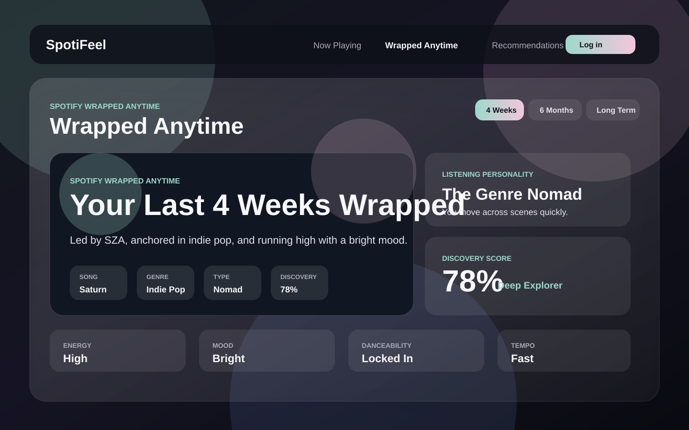

# SpotiFeel

Spotify Wrapped Anytime: connect Spotify and generate a polished personal music report for the last 4 weeks, last 6 months, or all-time listening.



The preview above uses mock text so the repo can show the product direction without exposing private Spotify data. Capture a real logged-in screenshot after configuring OAuth.

## Features

- Spotify OAuth login with session refresh
- Wrapped Anytime dashboard with 3 ranges: 4 weeks, 6 months, all time
- Top artists, top songs, top genres, mood profile, listening personality, replay loops, and discovery score
- Shareable PNG image card with native share/download fallback
- Live now-playing view with album-art theming, lyrics, YouTube search, and playback controls
- Recent listening timeline and playlist generation
- Optional Last.fm and YouTube integrations

## Tech Stack

- Flask backend
- Vanilla JavaScript, HTML, and CSS frontend
- Spotify Web API
- Vercel Python deployment config

## Local Setup

1. Create a Spotify app at the Spotify Developer Dashboard.
2. Add this redirect URI to the Spotify app exactly:

```text
http://127.0.0.1:5001/callback
```

3. Create a local environment file:

```bash
cp .env.example .env
```

4. Fill in:

```text
SPOTIFY_CLIENT_ID=
SPOTIFY_CLIENT_SECRET=
SPOTIFY_REDIRECT_URI=http://127.0.0.1:5001/callback
FLASK_SECRET=
```

5. Install and run:

```bash
python3 -m venv .venv
source .venv/bin/activate
pip install -r backend/requirements.txt
python backend/app.py
```

6. Open:

```text
http://127.0.0.1:5001
```

## Spotify Scopes

SpotiFeel currently asks for:

```text
user-read-currently-playing
user-read-playback-state
user-modify-playback-state
playlist-modify-private
playlist-modify-public
user-read-recently-played
user-library-read
user-top-read
```

`user-top-read` powers the Wrapped Anytime report. Spotify exposes `short_term`, `medium_term`, and `long_term`; the all-time view uses Spotify's `long_term` affinity ranking, not exact lifetime play count.

## Key Endpoints

- `GET /api/session` checks auth and Spotify configuration
- `GET /api/wrapped?time_range=short_term` builds a 4-week report
- `GET /api/wrapped?time_range=medium_term` builds a 6-month report
- `GET /api/wrapped?time_range=long_term` builds an all-time report
- `GET /api/now-playing` syncs the live player
- `GET /api/recently-played` loads recent listening
- `POST /api/create-playlist/<type>` creates a Spotify playlist

## Deployment Notes

The included `vercel.json` routes all requests to `backend/app.py`. In Vercel, add the same environment variables from `.env.example`, then set `SPOTIFY_REDIRECT_URI` to your deployed callback URL:

```text
https://your-domain.vercel.app/callback
```

That exact URL must also be added to the Spotify app redirect URI list.

## Product Roadmap

- AI music roast and personality analysis
- Friend compatibility reports
- Saved monthly and seasonal reports
- User accounts and report history
- Public leaderboards or anonymous trend stats
- Analytics for report generation and share conversion

## Troubleshooting

- `spotify_not_configured`: `.env` is missing Spotify credentials or redirect URI.
- `Invalid state parameter`: cookies/session changed during OAuth; retry login from the same browser.
- Spotify redirect mismatch: the `.env` value and Spotify Developer Dashboard URI must match exactly.
- Empty top tracks/artists: the Spotify account may not have enough listening history for that range.
